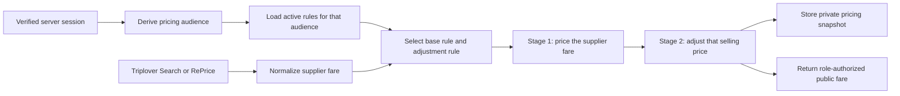

# Fare Pricing Rules: Markup and Discounts

This is the developer guide for ShoponTravels selling-price rules. It describes
the current behavior of `/dashboard/markup`, the server-side pricing engine,
rule precedence, database constraints, and the checks required when the feature
changes.

Last reviewed against the implementation: 2026-07-31.

## 1. The short version

- Only a verified Super Admin can create, edit, pause, or delete rules.
- The browser never chooses its pricing audience. Search and RePrice derive it
  from the verified server session.
- A rule targets one audience and one airline/route coverage combination.
- Pricing has **two stages**. A base rule (all airlines, all routes) prices the
  supplier fare; one adjustment rule (agency, airline, or route) then modifies
  that selling price. Never more than two rules; matching rules beyond these
  two are ignored.
- A percentage is always a percentage of the **running selling price**: the
  supplier payable at stage one, the stage one result at stage two. Both stages
  modify a price, so the effect always matches the number the rule is applied
  to.
- Positive normal markup starts from supplier payable and is capped at gross.
  The cap and the floor are re-checked after **each** stage, so composition
  cannot walk past either.
- Negative fixed or percentage values are discounts. They may go below supplier
  payable, but cannot remove taxes or AIT.
- The explicitly enabled LCC service-margin mode replaces the calculation
  rather than adjusting it, and is the only rule allowed above safe gross,
  which is the greater of calculated gross and supplier payable.
- Search and RePrice run the same rule selection and price calculation.
- Commercial rules and complete pricing snapshots remain server-only.

## 2. End-to-end flow



The active-rule database read starts alongside the Triplover request, so the
application does not add a separate sequential database wait after the supplier
responds. Rule selection is performed locally for each normalized itinerary.

## 3. Source map

| File | Responsibility |
| --- | --- |
| [`components/dashboard/MarkupManager.tsx`](./components/dashboard/MarkupManager.tsx) | Four-step rule builder, preview, rule list, and edit/pause/delete controls |
| [`app/(dashboard)/dashboard/markup/page.tsx`](<./app/(dashboard)/dashboard/markup/page.tsx>) | Super Admin page guard and initial rule/agency loading |
| [`app/(dashboard)/dashboard/markup/actions.ts`](<./app/(dashboard)/dashboard/markup/actions.ts>) | Role-checked, rate-limited server mutations and input validation |
| [`lib/markup.ts`](./lib/markup.ts) | Client-safe types, validation, audience mapping, rule selection, and exact pricing arithmetic |
| [`lib/db/markup-rules.ts`](./lib/db/markup-rules.ts) | Server-only Supabase reads and writes |
| [`lib/triplover/search.ts`](./lib/triplover/search.ts) | Applies markup to normalized Search offers and stores private snapshots |
| [`lib/triplover/reprice.ts`](./lib/triplover/reprice.ts) | Re-runs current markup against the live RePrice result |
| [`app/api/flights/search/route.ts`](./app/api/flights/search/route.ts) | Derives the Search pricing audience from the session |
| [`app/api/flights/reprice/route.ts`](./app/api/flights/reprice/route.ts) | Re-derives the RePrice pricing audience from the session |
| [`lib/flights/search-cache.ts`](./lib/flights/search-cache.ts) | Stores supplier references and pricing snapshots outside the browser |
| [`supabase/migrations/0006_markup_rules.sql`](./supabase/migrations/0006_markup_rules.sql) | Initial markup table |
| [`supabase/migrations/0007_capped_and_lcc_markup.sql`](./supabase/migrations/0007_capped_and_lcc_markup.sql) | Margin share and explicit LCC mode |
| [`supabase/migrations/0010_all_airlines_markup.sql`](./supabase/migrations/0010_all_airlines_markup.sql) | All-airlines/all-routes coverage |
| [`supabase/migrations/0011_all_airlines_route_markup.sql`](./supabase/migrations/0011_all_airlines_route_markup.sql) | All-airlines/specific-route coverage |
| [`supabase/migrations/0012_all_b2b_markup_audience.sql`](./supabase/migrations/0012_all_b2b_markup_audience.sql) | All-B2B audience |
| [`supabase/migrations/0013_negative_markup_discounts.sql`](./supabase/migrations/0013_negative_markup_discounts.sql) | Negative fixed and percentage discounts |
| [`supabase/migrations/0014_prevent_overlapping_markup_routes.sql`](./supabase/migrations/0014_prevent_overlapping_markup_routes.sql) | Rejects duplicate and bidirectionally overlapping route scopes |

## 4. Pricing audiences

`pricingAudienceForRole()` converts the verified dashboard session to a
commercial pricing identity.

| Signed-in identity | Pricing audience | Matching rule audiences | No matching rule |
| --- | --- | --- | --- |
| Super Admin | `superadmin` | None; rule lookup is bypassed | Supplier payable |
| B2B agency owner with a valid agency code | `agency` | That `agency` plus `b2b` fallback rules | Supplier payable |
| B2B sub-user with a valid agency code | `agency` | That `agency` plus `b2b` fallback rules | Supplier payable |
| B2C customer, staff, admin, unknown role, or signed-out visitor | `b2c` | `b2c` only | Gross |

If an expected B2B role has no valid agency code, it safely falls back to B2C
pricing. The request body must never be allowed to supply or override the
audience.

The rule builder exposes three audience choices:

1. **B2C customers**: public customer fares across the site.
2. **All B2B users**: every B2B agency and all its sub-users.
3. **Specific agent**: one agency and all its sub-users.

For `b2c` and `b2b`, `agency_code` must be `NULL`. For `agency`, it must contain
a valid agency code.

## 5. Coverage choices

The UI supports all four combinations:

| UI choice | `airline_code` | `origin` / `destination` | Airline code required? |
| --- | --- | --- | --- |
| All airlines + all routes | `NULL` | `NULL` / `NULL` | No |
| Specific airline + all routes | Two-character code | `NULL` / `NULL` | Yes |
| Specific airline + specific route | Two-character code | Three-letter airport pair | Yes |
| All airlines + specific route | `NULL` | Three-letter airport pair | No |

Airline codes accept two uppercase letters or numbers. Airport codes accept
three uppercase letters. Client input is normalized again by the server
validator.

`bidirectional = true` is meaningful only for a specific route. For example,
`DAC -> CXB` with bidirectional enabled also matches `CXB -> DAC`.

## 6. How the two rules are chosen

`selectMarkupRules()` returns at most two rules:

| Stage | Scope of the rule | Job |
| --- | --- | --- |
| `base` | All airlines **and** all routes | Prices the supplier fare |
| `adjustment` | Any rule naming an airline, a route, or both | Modifies the base stage result |

It filters active matching rules exactly as before, sorts them with the same
comparator, and then takes the best rule of each scope. Precedence inside a
stage is unchanged:

1. A specific-agency rule beats an all-B2B rule.
2. A route-specific rule beats an all-routes rule.
3. At the same route specificity, a specific-airline rule beats an
   all-airlines rule.
4. For a multicity search, a match on the earliest requested leg wins.
5. `updated_at` descending is the deterministic final tie-breaker.

This means **all airlines + specific route** beats **specific airline + all
routes** *within the adjustment stage*, because route specificity is evaluated
before airline specificity.

For one agency, the adjustment stage resolves in this order:

1. Specific agent + specific airline + specific route
2. Specific agent + all airlines + specific route
3. Specific agent + specific airline + all routes
4. The same three coverage levels for the all-B2B audience

and the base stage resolves between the agent's own all-airlines/all-routes
rule and the all-B2B one, preferring the agent's. B2C uses the same shape but
has no cross-audience fallback.

**The two stages resolve independently.** An agency keeps its own base margin
even when the winning adjustment came from the all-B2B audience.

This is the one precedence consequence worth knowing. The single-rule engine
sorted by audience tier *first*, so an agency's own all-airlines/all-routes
rule outranked **every** all-B2B rule, including route- and airline-specific
ones: those never reached that agency at all. With independent stages, the
agency's rule takes the base slot and a scoped all-B2B rule can now adjust it.
An agency that should ignore all-B2B scoped rules needs its own rule at the
same coverage, which outranks the all-B2B one inside the adjustment stage.

Rules beyond these two never apply. A specific-airline rule and an
all-airlines/specific-route rule cannot both adjust the same itinerary; the
precedence list above picks one.

The database unique index permits only one row for an exact
audience/agency/airline/route/direction scope, so at most one base rule can
exist per audience.

A trigger also rejects semantically overlapping route scopes: for example,
`DAC -> CXB` cannot coexist with `DAC <-> CXB` in the same audience and airline
scope. Opposite one-way rules remain valid. The markup type is not part of the
unique scope. To change the calculation for an existing scope, edit its rule
instead of creating another one.

## 7. Calculation types and validation

| Type | Meaning | Accepted value |
| --- | --- | --- |
| `fixed` | BDT per passenger | `-1,000,000` through `1,000,000`, excluding `0` |
| `percentage` | See the basis table below | `-100` through `100`, excluding `0` |
| `margin_share` | Percentage of available supplier-to-gross margin | `0` through `100` |

Positive fixed and percentage values are markups. Negative values are
discounts. Margin share is never negative.

A percentage is always a percentage of the **running selling price** — the
price the rule is being applied to:

| Stage | Percentage is a percentage of |
| --- | --- |
| `base` | The **supplier payable** |
| `adjustment` | The **stage 1 result** |
| LCC service margin | The supplier **base fare** |

With no base rule, stage 2 also starts from the supplier payable, so a lone
scoped rule and a lone base rule price identically. The LCC service margin is
the one exception: it replaces the calculation instead of adjusting a price,
so it keeps the base fare as its basis.

`margin_share` also ignores the stage: its basis is the supplier-to-gross
margin, a property of the supplier fare, in both slots.

Fixed markup multiplies the configured value by the total passenger count.
Percentage and margin-share calculations already use totals for the whole
offer, so they are not multiplied by passenger count again.

In code the basis is a property of the function you call —
`runningStageAmount()` for either stage, `lccServiceAmount()` for the
exception — not a branch, so a future edit cannot silently point a stage at
the wrong number.

All business validation must remain in `validateMarkupRuleInput()`. HTML input
attributes are usability aids, not a security or data-integrity boundary.

## 8. Pricing formulas

All money arithmetic is converted to integer minor units before calculation.
Percentages are converted to basis points. This avoids accumulated
floating-point errors.

```text
gross = basePrice + taxes + ait + serviceCharge
availableMargin = max(0, gross - supplierPayable)
safeGross = max(gross, supplierPayable)

minimumSelling = max(
  offer taxes + offer AIT,
  sum of each passenger fare's taxes + AIT
)

fixedRequest = rule.value * passengerCount
percentageRequest = basis * rule.value / 100
marginShareRequest = availableMargin * rule.value / 100
```

### The guard rail

One clamp, applied after every stage:

```text
clamp(price) = max(minimumSelling, min(price, safeGross))
```

The upper bound caps positive markup at gross. The lower bound limits a
discount so taxes and AIT remain payable. The floor is applied last, so it
still wins if the two ever cross.

### Normal markup or discount

```text
selling₁ = clamp(supplierPayable + request(supplierPayable))  // stage 1
selling₂ = clamp(selling₁        + request(selling₁))         // stage 2
```

Each stage calculates from the price it is applied to. With no base rule,
stage 1 is skipped and the running price stays at supplier payable. With no
adjustment rule, `clamp` is idempotent and `selling₂` equals `selling₁`. Either
way a lone rule prices identically in either slot.

Because the clamp runs after each stage, a positive adjustment on top of a base
rule that already reached the cap adds nothing, and no combination of rules can
sell above gross or below payable taxes and AIT.

Important commercial behavior: a negative rule can make the selling price
lower than supplier payable. The protection is a taxes-and-AIT floor, not a
supplier-payable floor. Treat any change to this behavior as a business and
financial decision.

`PricingSnapshot.grossCapApplied` records an upper-cap event in either stage.
`PricingSnapshot.discountFloorApplied` records a lower-floor event in either
stage. `PricingSnapshot.components` records each stage — its rule, the basis
the calculation used, the requested amount, and the running price before and
after — so any stored selling price can be reconstructed without re-reading the
rules table. Snapshots written before two-stage pricing have no `components`.
`ruleId`, `markupType` and `markupValue` continue to describe the single most
specific rule that priced the offer.

### LCC service-margin exception

An explicitly enabled `lcc_service_margin` rule uses safe gross as the baseline
and adds the requested amount above it. Safe gross is the higher of calculated
gross and supplier payable:

```text
sellingPrice = max(gross, supplierPayable) + requestedServiceMargin
```

This mode:

- must target a specific airline, so it can only ever occupy the adjustment
  slot;
- **replaces** the calculation instead of adjusting it — the base rule does not
  apply, and its percentage stays a percentage of base fare;
- accepts only a positive fixed or percentage value;
- does not accept margin share or discounts; and
- is the only pricing path intentionally allowed above gross.

Ignoring the base rule costs nothing commercially: an LCC fare has no
supplier-to-gross margin, so a base rule would have been clamped to zero
anyway. It keeps "one deliberate exception above gross" true.

The application does not automatically identify an LCC from the carrier code.
The Super Admin must deliberately enable the switch for the rule.

## 9. Worked examples

The rule builder preview uses this illustrative one-passenger fare:

```text
base fare          BDT 4,524.00
taxes + AIT        BDT 1,225.00
gross              BDT 5,749.00
supplier payable   BDT 5,350.89
available margin   BDT   398.11
```

| Rule | Requested | Applied | Selling price | Reason |
| --- | ---: | ---: | ---: | --- |
| Fixed BDT `300` | BDT 300.00 | BDT 300.00 | BDT 5,650.89 | Within available margin |
| Fixed BDT `500` | BDT 500.00 | BDT 398.11 | BDT 5,749.00 | Capped at gross |
| Percentage `5` | BDT 267.54 | BDT 267.54 | BDT 5,618.43 | 5% of supplier payable |
| Percentage `-5` | BDT -267.54 | BDT -267.54 | BDT 5,083.35 | Discount from supplier payable |
| Fixed BDT `-250` | BDT -250.00 | BDT -250.00 | BDT 5,100.89 | Discount from supplier payable |
| Margin share `50` | BDT 199.06 | BDT 199.06 | BDT 5,549.95 | 50% of available margin |
| LCC fixed BDT `200` | BDT 200.00 | BDT 200.00 | BDT 5,949.00 | Explicitly added above gross |

### Two stages together

A rounder fare makes the composition easy to follow:

```text
base fare          BDT 4,800.00
taxes + AIT        BDT 1,200.00
gross              BDT 6,000.00
supplier payable   BDT 5,600.00
available margin   BDT   400.00
```

| Base rule | Adjustment rule | Stage 1 | Stage 2 | Reason |
| --- | --- | ---: | ---: | --- |
| `+1%` | none | BDT 5,656.00 | — | 1% of the 5,600 supplier payable |
| `+1%` | BS `-300` fixed | BDT 5,656.00 | BDT 5,356.00 | 300 off the stage 1 price |
| `+1%` | BS `-5%` | BDT 5,656.00 | BDT 5,373.20 | 5% of the 5,656 stage 1 price |
| `+300` | BS `+300` | BDT 5,900.00 | BDT 6,000.00 | Stage 2 stops at the gross cap |
| `-100` | BS `-9,000` | BDT 5,500.00 | BDT 1,200.00 | Stage 2 stops at the taxes + AIT floor |

The builder preview calls the same `priceOffer()` function used by Search and
RePrice, with the illustrative values above, and resolves the real saved base
rule for the chosen audience so a scoped draft is previewed in context. This
keeps caps, discount floors, safe-gross behavior, and minor-unit rounding
identical; Search and RePrice replace only the sample inputs with each live
supplier response.

## 10. Failure behavior

Pricing must fail closed without exposing supplier net.

| Situation | Selling-price behavior |
| --- | --- |
| B2C has no matching rule in either stage | Safe gross: the greater of calculated gross and supplier payable |
| Agency has no matching rule in either stage | Supplier payable |
| Adjustment rule matches but no base rule does | Stage 1 is skipped; the adjustment prices from supplier payable |
| Base rule matches but no adjustment rule does | Stage 2 is skipped; the base rule alone prices the fare |
| Super Admin search | Supplier payable; no rule lookup |
| Rule storage is unavailable for any customer-facing audience | Safe gross |
| Requested positive markup exceeds available margin | Cap at gross, in whichever stage reaches it |
| Requested discount would remove taxes or AIT | Stop at the taxes-and-AIT floor |

The pricing-rules page disables changes when storage is unconfigured or its initial
read fails. Database errors are logged server-side and converted to safe,
actionable UI messages.

## 11. UI and mutation path

The rule builder has four progressive steps:

1. Choose the audience.
2. Choose airline/route coverage. Only the fields required by that coverage
   appear.
3. Choose markup or discount calculation and optional advanced settings.
4. Review the illustrative price preview and save.

The builder prevents incomplete or incompatible drafts from reaching the
server:

- **Create rule** or **Save changes** is disabled while a required agent,
  airline, route, or valid value is missing, and the UI explains what remains.
- Changing the calculation type keeps a compatible value. Otherwise it
  normalizes to a valid default: `±200` for fixed BDT, `±5` for percentage, or
  `50` for margin share.
- All calculation inputs support `0.01` increments, including decimal margin
  shares.
- Choosing all-airlines coverage clears the airline code and disables LCC
  service-margin mode.
- Turning on LCC mode converts margin share to fixed BDT and makes the value
  positive. Entering a zero or negative value turns LCC mode off.
- The client validator provides immediate guidance, but the server repeats the
  complete validation before every write.

The save path is:

```text
MarkupManager
  -> saveMarkupRuleAction
  -> verify Super Admin session
  -> validate UUID for edits
  -> apply manageMarkup rate limit
  -> validateMarkupRuleInput
  -> saveMarkupRule
  -> revalidate /dashboard/markup
```

Pause/resume and delete actions repeat the Super Admin, UUID, and rate-limit
checks. Hiding the navigation link is not authorization: the page itself and
every mutation enforce the role.

## 12. Database model and security

`markup_rules` contains:

| Group | Columns |
| --- | --- |
| Target | `audience`, `agency_code`, `airline_code`, `origin`, `destination`, `bidirectional` |
| Calculation | `markup_type`, `value`, `lcc_service_margin`, `active` |
| Audit | `created_by`, `created_at`, `updated_at` |

The table has RLS enabled with no browser policies. Only the server-side
service-role client reads or writes it. Do not add a client-side Supabase query
for markup rules.

Schema changes are forward-only migrations. Do not rewrite a migration that may
already have been applied. Add a new numbered migration and keep database
constraints aligned with `validateMarkupRuleInput()`.

Migration `0014` installs
`public.prevent_overlapping_markup_routes()` as a before-insert/update trigger.
Within the same audience, agency, and airline scope it rejects the same directed
route and any overlap involving a bidirectional rule. It deliberately permits
opposite one-way rules such as `DAC -> CXB` and `CXB -> DAC`.

## 13. Search, RePrice, and booking consistency

Search and RePrice both:

1. derive the current pricing audience from the server session;
2. load the current active rules;
3. call `selectMarkupRules()`; and
4. call `priceOffer()`.

Search stores the selected rule and complete `PricingSnapshot` beside opaque
supplier references in `flight_search_quotes`. RePrice retrieves the private
references, calls Triplover again, and calculates the current price with the
same engine. The refreshed snapshot is used by the booking foundation.

When pricing behavior changes, update and verify both Search and RePrice. Never
trust a previous browser-provided total as the current bookable price.

## 14. Safe development checklist

When adding an audience, coverage type, or calculation mode:

1. Update types and server validation in `lib/markup.ts`.
2. Update both new-rule and edit-rule mapping in `MarkupManager.tsx`.
3. Add a forward-only Supabase migration for constraints or columns.
4. Update `RuleRow`, `SELECT`, `toRule()`, and `rowFor()` in
   `lib/db/markup-rules.ts`.
5. Update active audience queries without broadening commercial data access.
6. Update `selectMarkupRules()` and document the exact precedence, keeping the
   base and adjustment stages separately resolved.
7. Update `priceOffer()` using integer minor-unit arithmetic, and keep every
   stage behind `clampSelling()`.
8. Verify the same behavior through Search and RePrice.
9. Update the preview, rule labels, this guide, and `DATABASE.md`.
10. Run the automated checks and the manual matrix below.

Do not:

- accept an audience, agency code, supplier price, or prior selling total from
  the browser as authoritative;
- apply more than one rule per stage, or add a third stage;
- clamp only once at the end instead of after each stage;
- query the database once per itinerary;
- expose service-role credentials, supplier references, or full pricing
  snapshots to the browser;
- allow ordinary positive markup above gross;
- silently enable LCC mode based only on an airline list; or
- remove the discount floor without explicit commercial approval.

## 15. Verification checklist

Run:

```powershell
npm run typecheck
npm run lint
npm run build
npx supabase db push --linked --dry-run
```

Verification baseline on 2026-07-30: typecheck, lint, and production build pass;
the linked Supabase project is synchronized through migration `0014`; and the
authenticated Super Admin builder was smoke-tested without creating a live
rule.

Minimum pricing test matrix:

- B2C, all B2B, specific agency, and Super Admin audience resolution
- all four airline/route coverage combinations
- base rule alone, adjustment rule alone, and both together
- an agency base rule combined with an all-B2B adjustment rule
- base-stage percentage taken from the supplier payable
- adjustment-stage percentage taken from the stage 1 price
- a lone rule pricing identically in either slot
- a positive adjustment adding nothing when stage 1 already hit the gross cap
- specific agency overriding all B2B
- route-specific overriding all-routes
- specific airline overriding all airlines at equal route specificity
- direct and bidirectional route matching
- rejection of duplicate and bidirectionally overlapping route scopes
- earliest-leg selection for multicity
- positive fixed and percentage calculations
- positive markup capped at gross
- negative fixed and percentage calculations
- discount limited at the taxes-and-AIT floor
- margin share at `0`, a middle value, and `100`
- LCC fixed and percentage rules above gross
- rejection of negative, zero, margin-share, or all-airline LCC rules
- no-rule fallback for each audience
- rule-storage failure falling back to safe gross
- identical results from Search and RePrice for the same supplier values

Manual UI smoke test:

1. Sign in as Super Admin and open `/dashboard/markup`.
2. Confirm all three audiences and all four coverage cards are present.
3. Confirm an airline code appears only for specific-airline coverage.
4. Confirm origin and destination appear only for route coverage.
5. Enter `-5` as Percentage and confirm the preview identifies a discount.
6. Enter `-250` as Fixed BDT and confirm the preview decreases.
7. Switch calculation types and confirm an out-of-range value is replaced with
   a valid default.
8. Confirm Margin Share accepts a value such as `12.5`.
9. Confirm an incomplete rule disables **Create rule** and explains what is
   missing.
10. Confirm an LCC switch cannot produce a negative or margin-share rule.
11. Do not create a real active rule during a smoke test unless test data and
   its cleanup are explicitly planned.

## 16. Troubleshooting

| Symptom | Likely explanation |
| --- | --- |
| Airline code is required for all-airlines coverage | The UI scope-to-input mapping is wrong; all-airlines must submit `airlineCode: null` |
| Duplicate rule error | The exact audience/agency/airline/route/direction scope already exists; edit it |
| Super Admin does not see markup | Expected: Super Admin is the supplier-payable audit audience |
| A large positive rule has no further effect | It reached the gross cap |
| A large discount is smaller than requested | It reached the taxes-and-AIT floor |
| An airline rule seems to add less than configured | Expected if the base rule already reached the gross cap; check `components` in the snapshot |
| A percentage looks bigger than expected | Expected: a percentage is taken from the running selling price — the supplier payable at stage 1, the stage 1 result at stage 2 — never from the base fare |
| A price changed after adding an unrelated global rule | Expected: the global rule is now the base stage for that audience |
| Agency receives the all-B2B value | No matching specific-agency rule outranked it in that stage |
| An all-airlines route rule beats an airline-wide rule | Expected: route specificity outranks airline specificity |
| A route-overlap error appears | A one-way or bidirectional rule already covers that route in the same audience and airline scope |
| LCC rule does not add above gross | Confirm it is positive, fixed/percentage, targets one airline, and has `lcc_service_margin = true` |
| All customer-facing prices show safe gross | Rule storage may be unavailable; check server logs and Supabase configuration |
| Client and server validation disagree | `draftValidationMessage()`, `validateMarkupRuleInput()`, or database constraints have drifted; align all three layers |

## 17. Related documentation

- [`DATABASE.md`](./DATABASE.md) for Supabase setup, migrations, and the complete schema.
- [`projectmap.md`](./projectmap.md) for the wider application architecture.
- [`Triploaver_API_Documentation.md`](./Triploaver_API_Documentation.md) for supplier API behavior.
