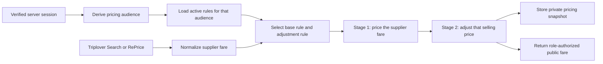

# Pricing and Markup System

This document describes the ShoponTravels pricing engine, including the two-stage markup model, rule structure, audience-based pricing, and integration with flight search. The pricing system applies commercial markup and discount rules to supplier fares to generate selling prices for different customer segments.

**Related Documentation:**
- [`docs/05-FLIGHT-SEARCH.md`](./05-FLIGHT-SEARCH.md) - Flight search architecture and supplier integration
- [`docs/12-DATABASE.md`](./12-DATABASE.md) - Database schema and relationships
- [`MARKUP.md`](../MARKUP.md) - Original developer guide for fare pricing rules

**Implementation Files:**
- [`lib/markup.ts`](../lib/markup.ts) - Client-safe types, validation, audience mapping, rule selection, and pricing arithmetic
- [`lib/db/markup-rules.ts`](../lib/db/markup-rules.ts) - Server-only Supabase reads and writes for markup rules
- [`lib/triplover/search.ts`](../lib/triplover/search.ts) - Applies markup to normalized Search offers
- [`lib/triplover/reprice.ts`](../lib/triplover/reprice.ts) - Re-runs current markup against live RePrice results

---

## 1. Pricing System Overview

The pricing system transforms supplier fares (from Triplover API) into selling prices for different customer audiences. It uses a rule-based markup engine that applies commercial rules while enforcing gross price caps and tax floor protections.

### Key Principles

1. **Server-Side Security**: Pricing rules are commercial data stored server-only. Browsers never query the markup_rules table directly (RLS enabled with no policies).

2. **Two-Stage Pricing**: Base rule prices the supplier fare; adjustment rule modifies that result. Never more than two rules per itinerary.

3. **Audience-Derived Pricing**: The browser never chooses its pricing audience. Search and RePrice derive it from the verified server session.

4. **Percentage Semantics**: A percentage is always a percentage of the **running selling price** (supplier payable at stage one, stage one result at stage two).

5. **Gross Cap and Tax Floor**: Positive markup cannot exceed supplier-to-gross margin; discounts cannot remove taxes or AIT. Both bounds are re-checked after each stage.

6. **LCC Exception**: Explicitly enabled LCC service-margin mode replaces calculation rather than adjusting it, allowing pricing above gross for low-cost carriers.

### Pricing Flow



The active-rule database read starts alongside the Triplover request, so the application does not add a separate sequential database wait after the supplier responds. Rule selection is performed locally for each normalized itinerary.

---

## 2. Two-Stage Pricing Model

The pricing engine uses exactly two stages to calculate the final selling price:

### Stage 1: Base Rule
- **Scope**: All airlines AND all routes
- **Purpose**: Prices the supplier fare to establish an initial selling price
- **Basis**: Supplier payable amount
- **Effect**: Applies markup/discount to transform supplier fare into selling price

### Stage 2: Adjustment Rule
- **Scope**: Any rule naming an airline, a route, or both
- **Purpose**: Modifies the base stage result for specific scenarios
- **Basis**: The running selling price (result from stage 1)
- **Effect**: Fine-tunes pricing for specific airlines, routes, or agencies

### Stage Independence

The two stages resolve independently:
- An agency keeps its own base margin even when the winning adjustment came from the all-B2B audience
- Each stage applies its own gross cap and tax floor
- Composition cannot walk past either bound because both are re-checked after each stage

### Example Calculation

```
Supplier Payable:  BDT 10,000
Gross Price:       BDT 12,000
Available Margin:  BDT 2,000

Stage 1 (Base: 10% of supplier):
  10,000 + (10,000 × 0.10) = 11,000
  Gross cap check: 11,000 ≤ 12,000 ✓

Stage 2 (Adjustment: 5% of running price):
  11,000 + (11,000 × 0.05) = 11,550
  Gross cap check: 11,550 ≤ 12,000 ✓

Final Selling Price: BDT 11,550
```

---

## 3. Markup Rule Structure

A markup rule defines how to price fares for a specific audience, airline, and route combination.

### Rule Properties

| Property | Type | Description |
| --- | --- | --- |
| `id` | `uuid` | Unique rule identifier |
| `audience` | `'b2c' \| 'b2b' \| 'agency'` | Target pricing audience |
| `agencyCode` | `string \| null` | Agency code (required for 'agency' audience) |
| `airlineCode` | `string \| null` | Two-character airline code, or NULL for all airlines |
| `origin` | `string \| null` | Three-letter origin airport code |
| `destination` | `string \| null` | Three-letter destination airport code |
| `bidirectional` | `boolean` | If true, route matches both directions |
| `markupType` | `'fixed' \| 'percentage' \| 'margin_share'` | How the markup value is applied |
| `value` | `number` | Markup/discount amount or percentage |
| `lccServiceMargin` | `boolean` | LCC service-margin exception mode |
| `active` | `boolean` | Whether the rule is currently active |
| `createdAt` | `timestamptz` | Rule creation timestamp |
| `updatedAt` | `timestamptz` | Last update timestamp |

### Markup Types

#### Fixed
- Applies a fixed amount per passenger
- Value range: -1,000,000 to 1,000,000 BDT (cannot be zero)
- Example: BDT 500 per passenger

#### Percentage
- Applies a percentage of the running selling price
- Value range: -100% to 100% (cannot be zero)
- Example: 10% markup or -5% discount
- Stored with 2 decimal precision, calculated using basis points

#### Margin Share
- Takes a percentage of the supplier-to-gross margin
- Value range: 0% to 100%
- Example: 50% of available margin
- Not compatible with LCC service-margin mode

---

## 4. Pricing Audiences

Pricing audiences define which commercial rules apply to a user session. The audience is derived only from the verified server session via `pricingAudienceForRole()` in [`lib/markup.ts`](../lib/markup.ts).

### Audience Mapping

| Signed-in Identity | Pricing Audience | Matching Rule Audiences | No Matching Rule |
| --- | --- | --- | --- |
| Super Admin | `superadmin` | None; rule lookup is bypassed | Supplier payable |
| B2B agency owner with valid agency code | `agency` | That `agency` plus `b2b` fallback rules | Supplier payable |
| B2B sub-user with valid agency code | `agency` | That `agency` plus `b2b` fallback rules | Supplier payable |
| B2C customer, staff, admin, unknown role, or signed-out visitor | `b2c` | `b2c` only | Gross |

### Audience Types

#### B2C (`b2c`)
- Public customer fares across the site
- `agencyCode` must be `NULL`
- Falls back to gross price if no rule matches

#### All B2B (`b2b`)
- Every B2B agency and all its sub-users
- `agencyCode` must be `NULL`
- Serves as fallback when agency-specific rules don't apply

#### Specific Agency (`agency`)
- One specific agency and all its sub-users
- `agencyCode` must contain a valid agency code
- Agency-specific rules take precedence over all-B2B rules

#### Super Admin (`superadmin`)
- Audit view of supplier payable amounts
- Rule lookup is bypassed entirely
- Always sees the raw supplier fare

### Fallback Behavior

If an expected B2B role has no valid agency code, it safely falls back to B2C pricing. The request body must never be allowed to supply or override the audience.

---

## 5. Rule Selection Logic and Precedence

The `selectMarkupRules()` function in [`lib/markup.ts`](../lib/markup.ts) returns at most two rules: one base rule and one adjustment rule.

### Selection Process

1. **Filter Active Rules**: Only rules with `active = true` are considered
2. **Filter by Audience**: Rules must match the derived pricing audience
3. **Filter by Airline**: Rules must match the itinerary's airline (or be NULL for all airlines)
4. **Filter by Route**: Rules must match a route in the itinerary (or be NULL for all routes)
5. **Sort by Precedence**: Apply precedence rules to rank candidates
6. **Select Base**: Choose the highest-priority rule with all-airlines/all-routes scope
7. **Select Adjustment**: Choose the highest-priority rule with any other scope

### Precedence Order

Inside each stage, rules are ranked by:

1. **Audience Specificity**: Specific-agency rule beats all-B2B rule
2. **Route Specificity**: Route-specific rule beats all-routes rule
3. **Airline Specificity**: At same route specificity, specific-airline beats all-airlines
4. **Leg Position**: For multicity search, match on earliest requested leg wins
5. **Update Time**: `updated_at` descending is the deterministic final tie-breaker

### Scope Precedence

**Important**: Route specificity is evaluated before airline specificity. This means:
- All airlines + specific route beats specific airline + all routes (within adjustment stage)
- Route matching is more important than airline matching

### Example: Agency Rule Resolution

For one agency, the adjustment stage resolves in this order:

1. Specific agent + specific airline + specific route
2. Specific agent + all airlines + specific route
3. Specific agent + specific airline + all routes
4. The same three coverage levels for the all-B2B audience

The base stage resolves between the agent's own all-airlines/all-routes rule and the all-B2B one, preferring the agent's.

### Coverage Combinations

The UI supports all four combinations:

| UI Choice | `airline_code` | `origin` / `destination` | Airline Code Required? |
| --- | --- | --- | --- |
| All airlines + all routes | `NULL` | `NULL` / `NULL` | No |
| Specific airline + all routes | Two-character code | `NULL` / `NULL` | Yes |
| Specific airline + specific route | Two-character code | Three-letter airport pair | Yes |
| All airlines + specific route | `NULL` | Three-letter airport pair | No |

### Bidirectional Routes

`bidirectional = true` is meaningful only for a specific route. For example, `DAC -> CXB` with bidirectional enabled also matches `CXB -> DAC`.

---

## 6. Markup Calculation

### Calculation Basis

All calculations use minor units (1/100 of currency unit) to avoid floating-point precision issues. Functions:
- `toMinor(amount)`: Converts to minor units (multiplies by 100)
- `fromMinor(amount)`: Converts from minor units (divides by 100)
- `allocateMinor(total, weights)`: Distributes total across weighted buckets

### Fixed Markup

```typescript
// Fixed amount per passenger
requestedMinor = toMinor(rule.value) * passengerCount
basisMinor = 0  // Fixed rules have no monetary basis
```

Example: BDT 500 fixed markup for 2 passengers
```
requestedMinor = 500 × 100 × 2 = 100,000 (BDT 1,000 total)
```

### Percentage Markup

```typescript
// Percentage of running selling price
basisMinor = runningSellingMinor
basisPoints = rule.value × 100  // Store 7.25% as 725 basis points
requestedMinor = (basisMinor × basisPoints) / 10,000
```

Example: 10% of BDT 10,000
```
basisPoints = 10 × 100 = 1,000
requestedMinor = (1,000,000 × 1,000) / 10,000 = 100,000 (BDT 1,000)
```

### Margin Share

```typescript
// Percentage of supplier-to-gross margin
basisMinor = availableMarginMinor  // gross - supplier
basisPoints = rule.value × 100
requestedMinor = (basisMinor × basisPoints) / 10,000
```

Example: 50% of BDT 2,000 margin
```
basisPoints = 50 × 100 = 5,000
requestedMinor = (200,000 × 5,000) / 10,000 = 100,000 (BDT 1,000)
```

### Stage Calculation

Each stage:
1. Calculates requested amount using `runningStageAmount()`
2. Adds to running selling price
3. Applies gross cap and tax floor via `clampSelling()`
4. Stores component in pricing snapshot for audit trail

---

## 7. LCC Service Margin Mode

LCC (Low-Cost Carrier) service-margin mode is an explicit exception that allows pricing above the gross price.

### Purpose

Low-cost carriers often have supplier payables equal to gross prices. Normal markup rules cannot exceed gross, but LCCs need a visible service margin added on top.

### Activation

A rule has `lccServiceMargin = true` when:
- It targets a specific airline (airline_code is not NULL)
- It uses fixed or percentage markup (not margin_share)
- The value is positive (cannot be used for discounts)

### Calculation

```typescript
if (lccServiceRule) {
  basis = 'lcc_service'
  // Safe gross is the baseline (max of calculated gross and supplier payable)
  requestedMarkup = lccAmount.requestedMinor
  appliedMarkup = lccAmount.requestedMinor
  serviceMarginMinor = lccAmount.requestedMinor
  sellingMinor = safeGrossMinor + lccAmount.requestedMinor
}
```

### Constraints

- LCC service-margin rules must target a specific airline (validation enforces this)
- Cannot be combined with margin_share markup type
- Must have positive value
- Replaces normal two-stage calculation (not an adjustment layer)

### Example

```
Supplier Payable:  BDT 10,000
Gross Price:       BDT 10,000  (equal for LCC)
LCC Service Margin: BDT 500 (fixed)

Final Selling Price: 10,000 + 500 = BDT 10,500
```

---

## 8. Negative Markup for Discounts

Negative fixed or percentage values represent discounts. These are bounded to ensure taxes and AIT remain payable.

### Discount Rules

- Fixed: Value range -1,000,000 to -1 BDT
- Percentage: Value range -100% to -0.01%
- Margin share: Cannot be negative (0% to 100% only)
- LCC service margin: Cannot be negative (must be positive)

### Discount Floor

Discounts may go below supplier payable but cannot remove taxes or AIT:

```typescript
const fareMinimums = fares.map(
  (fare) => toMinor(fare.taxes) + toMinor(fare.ait)
)
const minimumSellingMinor = fareMinimums.reduce((sum, amount) => sum + amount, 0)

// Clamp ensures selling price never falls below taxes + AIT
const clampSelling = (value) =>
  Math.max(minimumSellingMinor, Math.min(value, safeGrossMinor))
```

### Discount Allocation

When a discount is applied, the reduced amount is allocated proportionally across fare types while preserving tax and AIT amounts:

```typescript
if (appliedMarkup < 0) {
  // Allocate discount across fares, keeping taxes + AIT intact
  publicFareTotals = allocateMinor(
    sellingMinor - fareMinimumTotal,
    fares.map((fare) => supplierTotalPrice - (taxes + ait))
  ).map((amount, index) => amount + fareMinimums[index])
}
```

### Example

```
Supplier Payable:  BDT 10,000
Taxes:             BDT 1,500
AIT:               BDT 500
Discount:          -BDT 1,000 (fixed)

Minimum Selling:   1,500 + 500 = BDT 2,000
After Discount:    10,000 - 1,000 = BDT 9,000
Clamped:           max(2,000, 9,000) = BDT 9,000
```

---

## 9. Gross Price Caps and Floors

The pricing engine enforces both upper and lower bounds on selling prices to protect revenue and ensure tax compliance.

### Gross Cap (Upper Bound)

Positive markup cannot exceed the supplier-to-gross margin:

```typescript
const grossMinor = baseMinor + taxesMinor + aitMinor + serviceMinor
const safeGrossMinor = Math.max(grossMinor, supplierMinor)
const availableMarginMinor = Math.max(0, grossMinor - supplierMinor)

const clampSelling = (value) =>
  Math.max(minimumSellingMinor, Math.min(value, safeGrossMinor))
```

**Behavior:**
- If markup would exceed gross, selling price is capped at gross
- Applied after each stage, so composition cannot walk past the cap
- `grossCapApplied` flag in snapshot indicates if cap was hit

### Tax Floor (Lower Bound)

Discounts cannot remove taxes or AIT:

```typescript
const fareMinimums = fares.map(
  (fare) => toMinor(fare.taxes) + toMinor(fare.ait)
)
const minimumSellingMinor = fareMinimums.reduce((sum, amount) => sum + amount, 0)
```

**Behavior:**
- If discount would go below taxes + AIT, selling price is floored at that minimum
- Applied after each stage
- `discountFloorApplied` flag in snapshot indicates if floor was hit

### Stage-Level Enforcement

Both bounds are re-checked after **each** stage:

```typescript
// Stage 1
const target = runningMinor + stage.requestedMinor
const next = clampSelling(target)
grossCapApplied ||= target > safeGrossMinor
discountFloorApplied ||= target < minimumSellingMinor
runningMinor = next

// Stage 2
const target = runningMinor + stage.requestedMinor
const next = clampSelling(target)
grossCapApplied ||= target > safeGrossMinor
discountFloorApplied ||= target < minimumSellingMinor
runningMinor = next
```

This ensures that even if stage 1 uses the full margin, stage 2 cannot exceed gross, and even if stage 1 applies a deep discount, stage 2 cannot remove taxes.

---

## 10. Database Schema

The `markup_rules` table stores all pricing rules. The schema has evolved through migrations to support all features.

### Table Structure

```sql
create table public.markup_rules (
  id              uuid primary key default gen_random_uuid(),
  audience        text not null
                  check (audience in ('b2c', 'b2b', 'agency')),
  agency_code     text
                  references public.agencies (agency_code) on delete cascade,
  airline_code    text
                  check (airline_code is null or airline_code ~ '^[A-Z0-9]{2}$'),
  origin          text
                  check (origin is null or origin ~ '^[A-Z]{3}$'),
  destination     text
                  check (destination is null or destination ~ '^[A-Z]{3}$'),
  bidirectional   boolean not null default false,
  markup_type     text not null
                  check (markup_type in ('fixed', 'percentage', 'margin_share')),
  value           numeric(12, 2) not null,
  lcc_service_margin boolean not null default false,
  active          boolean not null default true,
  created_by      text
                  references public.app_users (clerk_id) on delete set null,
  created_at      timestamptz not null default now(),
  updated_at      timestamptz not null default now()
);
```

### Constraints

#### Audience Target Check
```sql
constraint markup_rules_audience_target_check check (
  (audience = 'b2c' and agency_code is null) or
  (audience = 'agency' and agency_code is not null) or
  (audience = 'b2b' and agency_code is null)
)
```
- B2C rules never name an agency
- Agency rules always name an agency
- B2B rules never name an agency

#### Route Pair Check
```sql
constraint markup_rules_route_pair_check check (
  (origin is null and destination is null and bidirectional = false) or
  (origin is not null and destination is not null and origin <> destination)
)
```
- Airline-only rules leave both route fields empty
- Route rules need both origin and destination
- Origin and destination must differ

#### Value Check
```sql
constraint markup_rules_value_check check (
  (markup_type = 'percentage' and value <> 0 and value >= -100 and value <= 100) or
  (markup_type = 'fixed' and value <> 0 and value >= -1000000 and value <= 1000000) or
  (markup_type = 'margin_share' and value >= 0 and value <= 100)
)
```
- Percentage: -100% to 100%, cannot be zero
- Fixed: -1,000,000 to 1,000,000 BDT, cannot be zero
- Margin share: 0% to 100%

#### Airline Scope Check
```sql
constraint markup_rules_airline_scope_check check (
  airline_code is not null or (
    origin is null and
    destination is null and
    bidirectional = false and
    lcc_service_margin = false
  )
)
```
- A route exception must name the airline
- Null airline is limited to all-airlines/all-routes fallback
- LCC service margin requires specific airline

#### LCC Mode Check
```sql
constraint markup_rules_lcc_mode_check check (
  lcc_service_margin = false or (
    markup_type in ('fixed', 'percentage') and
    value > 0
  )
)
```
- LCC service margin must be fixed or percentage
- LCC service margin must have positive value

### Indexes

#### Unique Scope Index
```sql
create unique index markup_rules_scope_unique_idx
  on public.markup_rules (
    audience,
    coalesce(agency_code, ''),
    coalesce(airline_code, ''),
    coalesce(origin, ''),
    coalesce(destination, ''),
    bidirectional
  );
```
- Prevents duplicate rules for the same audience, airline, and route
- Uses COALESCE to handle NULL values correctly

#### Lookup Index
```sql
create index markup_rules_lookup_idx
  on public.markup_rules (audience, agency_code, airline_code, active);
```
- Optimizes queries for active rules by audience

### Security

```sql
alter table public.markup_rules enable row level security;
```
- RLS is enabled with no policies
- Only server-side service-role client can read or write
- Browsers never query this table directly

### Migration History

| Migration | Purpose |
| --- | --- |
| [`0006_markup_rules.sql`](../supabase/migrations/0006_markup_rules.sql) | Initial markup table with fixed/percentage |
| [`0007_capped_and_lcc_markup.sql`](../supabase/migrations/0007_capped_and_lcc_markup.sql) | Added margin_share and lcc_service_margin |
| [`0010_all_airlines_markup.sql`](../supabase/migrations/0010_all_airlines_markup.sql) | Allow NULL airline_code for all-airlines fallback |
| [`0012_all_b2b_markup_audience.sql`](../supabase/migrations/0012_all_b2b_markup_audience.sql) | Added 'b2b' audience |
| [`0013_negative_markup_discounts.sql`](../supabase/migrations/0013_negative_markup_discounts.sql) | Allow negative values for discounts |
| [`0014_prevent_overlapping_markup_routes.sql`](../supabase/migrations/0014_prevent_overlapping_markup_routes.sql) | Reject duplicate and bidirectionally overlapping routes |

---

## 11. Integration with Flight Search

The pricing system integrates with flight search and reprice workflows to apply markup to supplier fares.

### Search Integration

In [`lib/triplover/search.ts`](../lib/triplover/search.ts):

```typescript
// 1. Derive pricing audience from session
const audience = pricingAudienceForRole(role, agencyCode)

// 2. Load active rules for that audience (in parallel with supplier request)
const { rules } = await activeMarkupRulesFor(audience)

// 3. For each normalized itinerary, select matching rules
const selection = selectMarkupRules(rules, audience, airlineCode, routes)

// 4. Apply pricing calculation
const pricedOffer = priceOffer({
  audience,
  rulesAvailable: true,
  rules: selection,
  supplierTotalPrice,
  basePrice,
  taxes,
  ait,
  fares,
  passengerCount
})

// 5. Store pricing snapshot in search cache
await storeSearch(itineraryRefs, pricedOffer.snapshot)
```

### Reprice Integration

In [`lib/triplover/reprice.ts`](../lib/triplover/reprice.ts):

```typescript
// 1. Derive pricing audience from session (same as search)
const audience = pricingAudienceForRole(role, agencyCode)

// 2. Load active rules for that audience
const { rules } = await activeMarkupRulesFor(audience)

// 3. Select matching rules based on reprice itinerary
const selection = selectMarkupRules(rules, audience, airlineCode, routes)

// 4. Apply pricing to live supplier fare
const pricedOffer = priceOffer({
  audience,
  rulesAvailable: true,
  rules: selection,
  supplierTotalPrice: liveSupplierPrice,  // Live price from supplier
  basePrice,
  taxes,
  ait,
  fares,
  passengerCount
})

// 5. Return updated offer with new pricing
```

### Pricing Snapshot

Each priced offer includes a private pricing snapshot stored in the search cache:

```typescript
type PricingSnapshot = {
  audience: 'b2c' | 'agency' | 'superadmin'
  agencyCode: string | null
  basis: 'gross' | 'supplier' | 'lcc_service'
  supplierTotalPrice: number
  grossPrice: number
  availableMargin: number
  requestedMarkupAmount: number
  markupAmount: number
  serviceMarginAmount: number
  sellingPrice: number
  grossCapApplied: boolean
  discountFloorApplied: boolean
  lccServiceMargin: boolean
  ruleId: string | null
  markupType: MarkupType | null
  markupValue: number | null
  components?: PricingComponent[]  // Two-stage detail
}
```

The snapshot enables:
- Audit trail of pricing decisions
- Reconstruction of selling price from stored data
- Debugging of pricing issues
- Verification of rule application

### Imported Booking Pricing

IMP/EXP pricing does not infer customer price from Supplier Gross. The operator
reviews the supplier/reference amount and explicitly enters User Payable:

| Concept | Storage | Wallet/payment use | Imported e-ticket use |
| ------- | ------- | ------------------ | --------------------- |
| Supplier Gross | `flight_bookings.supplier_gross_amount`; snapshot `supplierTotalPrice`/`grossPrice` | Never a debit basis | Supplier fare breakdown and ticket face total |
| User Payable | `flight_bookings.user_payable_amount`; snapshot `sellingPrice` | Assigned customer's actual payable and only debit basis | Never substituted into fare rows or ticket total |

Both database columns use integer minor units. Sync may refresh Supplier Gross
but must preserve User Payable. Re-import cannot silently change the protected
User Payable already stored for the supplier booking. The shared booking
projection uses Supplier Gross for imported web/PDF/email ticket presentation
without copying it into payment state or ledger data. See
[IMP/EXP Booking Imports](17-IMP-EXP-IMPORTS.md).

### Component Tracking

Each stage stores a component for full transparency:

```typescript
type PricingComponent = {
  stage: 'base' | 'adjustment'
  ruleId: string
  markupType: MarkupType
  markupValue: number
  basisAmount: number      // Money percentage was taken from
  requestedAmount: number   // Amount rule requested
  sellingBefore: number     // Price before this stage
  sellingAfter: number      // Price after this stage
}
```

### API Route Integration

The API routes derive the pricing audience from the verified session:

- [`app/api/flights/search/route.ts`](../app/api/flights/search/route.ts) - Derives Search pricing audience
- [`app/api/flights/reprice/route.ts`](../app/api/flights/reprice/route.ts) - Derives RePrice pricing audience

The request body must never be allowed to supply or override the audience.

---

## 12. Critical Invariants

These rules must never be broken when modifying the pricing system:

1. **Server-Only Rules**: Browsers must never query the markup_rules table directly. RLS is enabled with no policies; only the server-side service-role client may read or write.

2. **Audience Derivation**: The pricing audience must be derived only from the verified server session. The request body must never be allowed to supply or override the audience.

3. **Two-Stage Maximum**: Exactly two rules may apply: one base (all-airlines/all-routes) and one adjustment (any other scope). Matching rules beyond these two must be ignored.

4. **Gross Cap Enforcement**: Positive markup can never exceed the supplier-to-gross margin. The cap must be re-checked after each stage.

5. **Tax Floor Enforcement**: Discounts can never remove taxes or AIT. The floor must be re-checked after each stage.

6. **LCC Exception Only**: The only path allowed above gross is an explicitly flagged LCC service-margin rule. This mode must require a specific airline and positive value.

7. **Percentage Basis**: A percentage must always be a percentage of the running selling price (supplier payable at stage one, stage one result at stage two), except for margin_share which uses available margin.

8. **Minor Unit Arithmetic**: All monetary calculations must use minor units (1/100 of currency unit) to avoid floating-point precision issues.

9. **Super Admin Bypass**: Super Admin must always see supplier payable, regardless of configured rules. Rule lookup must be bypassed for this audience.

10. **Fallback Safety**: If the rules table cannot be read, customer-facing audiences must fall back to gross price rather than failing or showing incorrect pricing.

11. **Imported Commercial Price**: Imported booking wallet capture must use the explicit stored User Payable. Supplier Gross must never replace it as the payable, debit, captured amount, ledger amount, or wallet settlement amount.

12. **Imported Ticket Face Value**: Imported e-ticket fare rows and total must use supplier-authored fares and Supplier Gross. User Payable must not replace the airline ticket face value.

---

## 13. Before Modifying This System

When making changes to the pricing system, verify:

### Code Changes

- [ ] Review [`lib/markup.ts`](../lib/markup.ts) for validation logic changes
- [ ] Review [`lib/db/markup-rules.ts`](../lib/db/markup-rules.ts) for database access changes
- [ ] Review [`lib/triplover/search.ts`](../lib/triplover/search.ts) for search integration
- [ ] Review [`lib/triplover/reprice.ts`](../lib/triplover/reprice.ts) for reprice integration
- [ ] Test with all three audience types (b2c, b2b, agency)
- [ ] Test with all markup types (fixed, percentage, margin_share)
- [ ] Test LCC service-margin mode with positive values
- [ ] Test negative markup for discounts
- [ ] Verify gross cap is still enforced after each stage
- [ ] Verify tax floor is still enforced after each stage
- [ ] Test multicity itineraries with leg position precedence
- [ ] Test bidirectional route matching

### Database Changes

- [ ] Create a new migration file in `supabase/migrations/`
- [ ] Test constraint changes with valid and invalid data
- [ ] Verify unique index still prevents duplicate scopes
- [ ] Test RLS policies (should remain disabled for service-role)
- [ ] Backfill existing data if adding new columns
- [ ] Update this documentation with schema changes

### Validation Changes

- [ ] Review `validateMarkupRuleInput()` in [`lib/markup.ts`](../lib/markup.ts)
- [ ] Test client-side validation with edge cases
- [ ] Test server-side validation with forged requests
- [ ] Verify error messages are clear and actionable
- [ ] Test that validation prevents commercial rule violations

### Integration Testing

- [ ] Run full search flow with markup application
- [ ] Run full reprice flow with markup re-calculation
- [ ] Verify pricing snapshots are stored correctly
- [ ] Test fallback behavior when rules table is unavailable
- [ ] Verify audit trail in pricing components
- [ ] Test with actual Triplover supplier data

### Documentation Updates

- [ ] Update this document with any behavior changes
- [ ] Update [`MARKUP.md`](../MARKUP.md) if implementation details changed
- [ ] Update migration history in database schema section
- [ ] Add new critical invariants if rules changed
- [ ] Update cross-references to related systems

---

## 14. Common Pricing Scenarios

### Scenario 1: B2C Customer with No Rules

```
Audience: b2c
Rules: None matching
Result: Gross price (supplier fare + taxes + AIT + service charge)
```

### Scenario 2: B2B Agency with Base Rule Only

```
Audience: agency (agencyCode: "AGENCY01")
Base Rule: 10% fixed markup (all airlines, all routes)
Adjustment Rule: None
Result: Supplier payable + 10% markup
```

### Scenario 3: B2B Agency with Route Adjustment

```
Audience: agency (agencyCode: "AGENCY01")
Base Rule: 5% margin share (all airlines, all routes)
Adjustment Rule: 15% fixed markup (BG airline, DAC-CXB route)
Result:
  Stage 1: Supplier + 5% of margin
  Stage 2: Stage 1 result + 15% per passenger
```

### Scenario 4: LCC with Service Margin

```
Audience: b2c
LCC Rule: BDT 500 fixed service margin (BS airline, lccServiceMargin: true)
Result: Safe gross + BDT 500 (can exceed normal gross)
```

### Scenario 5: Discount Promotion

```
Audience: b2c
Base Rule: 10% percentage markup (all airlines, all routes)
Adjustment Rule: -5% percentage discount (all airlines, all routes)
Result:
  Stage 1: Supplier + 10%
  Stage 2: Stage 1 result - 5%
  Floor: Cannot go below taxes + AIT
```

### Scenario 6: Super Admin Audit View

```
Audience: superadmin
Rules: Bypassed
Result: Supplier payable (no markup applied)
```

---

## 15. Troubleshooting

### Pricing Not Applied

**Symptom**: Selling price equals supplier payable or gross, markup not visible.

**Check**:
1. Verify rules are active (`active = true`)
2. Verify audience matches rule audience
3. Verify airline code matches (or rule has NULL airline_code)
4. Verify route matches (or rule has NULL origin/destination)
5. Check pricing snapshot for `basis` field
6. Verify rules table is accessible (not a database error)

### Pricing Exceeds Gross

**Symptom**: Selling price higher than gross price (unless LCC mode).

**Check**:
1. Verify rule does not have `lccServiceMargin = true` unless intended
2. Check if margin_share is consuming more than available margin
3. Verify gross cap is applied after each stage
4. Check pricing snapshot for `grossCapApplied` flag

### Discount Removes Taxes

**Symptom**: Selling price below taxes + AIT.

**Check**:
1. Verify tax floor is applied after each stage
2. Check pricing snapshot for `discountFloorApplied` flag
3. Verify discount allocation preserves tax amounts
4. Check fare minimum calculation

### Wrong Audience Applied

**Symptom**: Agency seeing B2C pricing or vice versa.

**Check**:
1. Verify session has correct role
2. Verify agency code is valid for B2B roles
3. Check `pricingAudienceForRole()` logic
4. Verify request body is not overriding audience
5. Check API route audience derivation

### LCC Mode Not Working

**Symptom**: LCC service margin not applied above gross.

**Check**:
1. Verify rule has `lccServiceMargin = true`
2. Verify rule targets specific airline (airline_code not NULL)
3. Verify markup type is fixed or percentage (not margin_share)
4. Verify value is positive
5. Check that rule is selected in adjustment stage

---

## 16. Performance Considerations

### Database Query Optimization

- Active rules are loaded once per search/reprice request, not per offer
- `activeMarkupRulesFor()` uses indexed queries for fast lookup
- Unique scope index prevents duplicate rule reads
- Consider caching active rules if high traffic on single audience

### Calculation Efficiency

- All calculations use integer arithmetic (minor units)
- No floating-point operations in pricing path
- Allocation algorithm is O(n) where n is number of fare types
- Two-stage calculation is bounded and predictable

### Parallel Execution

- Rule database read starts alongside Triplover supplier request
- No sequential database wait after supplier responds
- Rule selection is performed locally in memory
- Pricing calculation is fast and deterministic

### Memory Usage

- Pricing snapshots are stored in search cache (outside browser)
- Components array adds small overhead per offer
- Rule set is typically small (dozens to hundreds of rules)
- No large data structures in pricing path

---

## 17. Security Considerations

### Commercial Data Protection

- Markup rules are commercial data and must remain server-only
- RLS enabled with no policies on markup_rules table
- Only service-role client can read/write rules
- Browser never queries markup_rules directly

### Input Validation

- All rule inputs validated server-side via `validateMarkupRuleInput()`
- Client-side validation is for UX only, not security
- Server validation rejects forged requests
- All numeric values bounded to prevent overflow

### Audience Derivation

- Pricing audience derived only from verified server session
- Request body cannot supply or override audience
- Super Admin bypass is enforced at calculation level
- Agency code validated against agencies table

### Audit Trail

- Pricing snapshots stored with search results
- Components array tracks two-stage calculation
- Gross cap and discount floor flags recorded
- Rule IDs and values preserved for audit

### Fallback Safety

- If rules table unavailable, customer audiences fall back to gross
- Never fails or shows incorrect pricing due to database issues
- Super Admin always sees supplier payable regardless
- Defense in depth: multiple validation layers

---

## 18. References

### Implementation Files

- [`lib/markup.ts`](../lib/markup.ts) - Core pricing logic (787 lines)
- [`lib/db/markup-rules.ts`](../lib/db/markup-rules.ts) - Database operations (230 lines)
- [`lib/triplover/search.ts`](../lib/triplover/search.ts) - Search integration
- [`lib/triplover/reprice.ts`](../lib/triplover/reprice.ts) - Reprice integration
- [`components/dashboard/MarkupManager.tsx`](../components/dashboard/MarkupManager.tsx) - Rule builder UI
- [`app/(dashboard)/dashboard/markup/page.tsx`](../app/(dashboard)/dashboard/markup/page.tsx) - Super Admin page
- [`app/(dashboard)/dashboard/markup/actions.ts`](../app/(dashboard)/dashboard/markup/actions.ts) - Server mutations

### Database Migrations

- [`supabase/migrations/0006_markup_rules.sql`](../supabase/migrations/0006_markup_rules.sql) - Initial table
- [`supabase/migrations/0007_capped_and_lcc_markup.sql`](../supabase/migrations/0007_capped_and_lcc_markup.sql) - Margin share and LCC
- [`supabase/migrations/0010_all_airlines_markup.sql`](../supabase/migrations/0010_all_airlines_markup.sql) - All-airlines support
- [`supabase/migrations/0012_all_b2b_markup_audience.sql`](../supabase/migrations/0012_all_b2b_markup_audience.sql) - B2B audience
- [`supabase/migrations/0013_negative_markup_discounts.sql`](../supabase/migrations/0013_negative_markup_discounts.sql) - Negative discounts
- [`supabase/migrations/0014_prevent_overlapping_markup_routes.sql`](../supabase/migrations/0014_prevent_overlapping_markup_routes.sql) - Route overlap prevention

### API Routes

- [`app/api/flights/search/route.ts`](../app/api/flights/search/route.ts) - Search endpoint
- [`app/api/flights/reprice/route.ts`](../app/api/flights/reprice/route.ts) - Reprice endpoint

### Related Documentation

- [`docs/05-FLIGHT-SEARCH.md`](./05-FLIGHT-SEARCH.md) - Flight search architecture
- [`docs/12-DATABASE.md`](./12-DATABASE.md) - Database schema
- [`docs/04-ROLES-AND-PERMISSIONS.md`](./04-ROLES-AND-PERMISSIONS.md) - Role-based access
- [`docs/17-IMP-EXP-IMPORTS.md`](./17-IMP-EXP-IMPORTS.md) - Imported Supplier Gross and User Payable rules
- [`MARKUP.md`](../MARKUP.md) - Original developer guide
- [`DATABASE.md`](../DATABASE.md) - Database guide
